# 3b1b_essence_of_linear_algebra

[TOC]

## 1、向量

- 物理视角：向量是空间中拥有**长度、方向**的箭头
- 计算机视角：向量是**有序数字列表**
- 数学通用视角：重点关注**向量加法、向量数乘**两种运算

### 1.1、向量加法

理解为先沿向量v运动，再沿向量w运动，是两段位移叠加

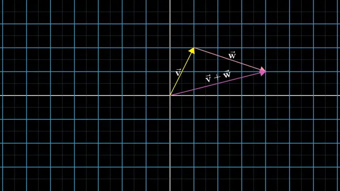

### 1.2、向量数乘

对向量进行**缩放**，改变长度，反向则乘以负数

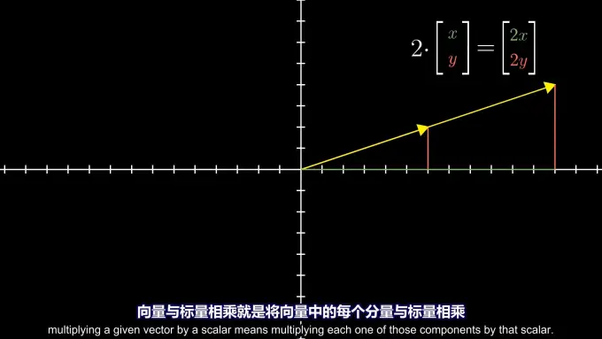

### 1.3、模长

定义：用于表示向量的长度，等于分量平方和的平方根。
向量 $\vec{v} = (v_1, v_2, ..., v_n)$ 的模长记作 $\|v\|$，表示原点到该向量终点的距离。计算公式如下：
$$
\|v\| = \sqrt{(v_1)^2 + (v_2)^2 + ... + (v_n)^2}
$$

### 1.4、单位向量

定义：模长为 1 的向量，用 $\hat{v}$ 表示。
$$
\hat{v} = \frac{\vec{v}}{\|\vec{v}\|}
$$

作用：
* 简化方向描述：
  只关心方向而不关心长度时，可以用单位向量表示，比如坐标轴方向常用：
  * x轴正方向：$\hat{i} = (1, 0)$
  * y轴正方向：$\hat{j} = (0, 1)$
* 分解任意向量：
  任意向量都可以写成“长度×方向”，$\vec{v} = \|v\| · \hat{v}$

## 2、线性组合、张成的空间和基

### 2.1、基向量

单位向量i，j是坐标系x、y的基向量

### 2.2、线性组合

两个数乘向量（标量乘以向量）的和称为这两个向量的线性组合

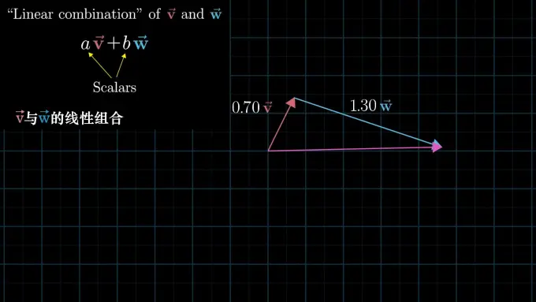

怎么理解线性？如果固定其中一个标量（a、b为标量），让另一个标量自由变化，所产生的向量在终点会描出一条直线。

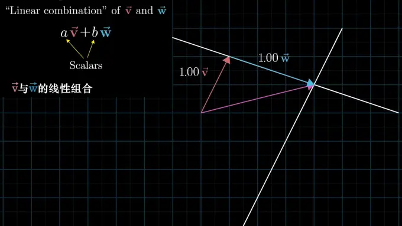

如果两个标量同时变化，就能得到当前平面的所有点，但存在两个标量共线（所产生的向量终点被限制在一条过原点的直线上）或者两个向量值都为零的情况。

### 2.3、张成空间

给定向量所有可能的线性组合（给定向量线性组合的向量的集合），称为给定向量张成的空间。

对于大多数二维向量来说，它们张成的空间就是所有二维向量的集合，即整个无限大的二维平面。当共线时，张成的空间是终点落在一条直线上。

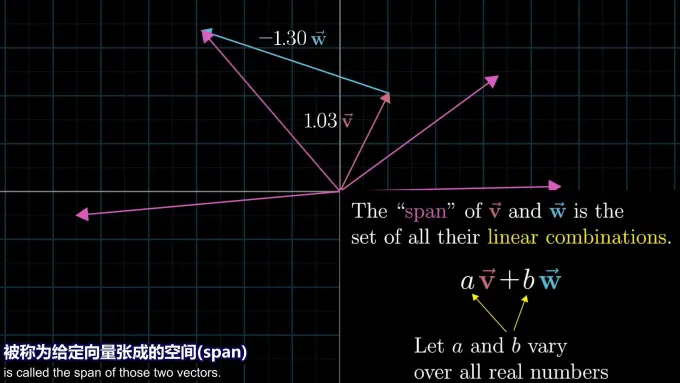

考虑单个向量的时候，可以把其看做一个箭头，当考虑多个向量的时候，可以将其看做一个点。

当两个向量（a、b）在三维空间中，其线性组合的终点会在三维空间中画出某个过原点的平面，终点落在平面上的向量的集合就是给定两个向量（a、b）张成的空间。

当三个向量的线性组合时，组成的张成空间如下，

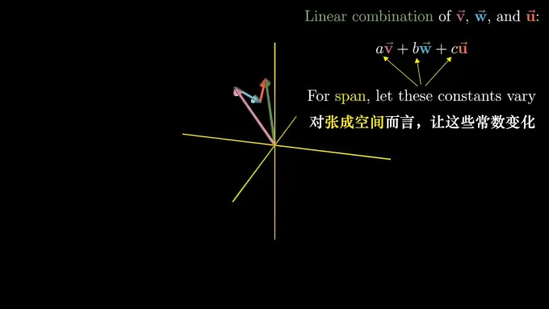

当第三个向量非共面时，张成空间将是整个三维空间，线性组合能组合三维空间的任意向量。

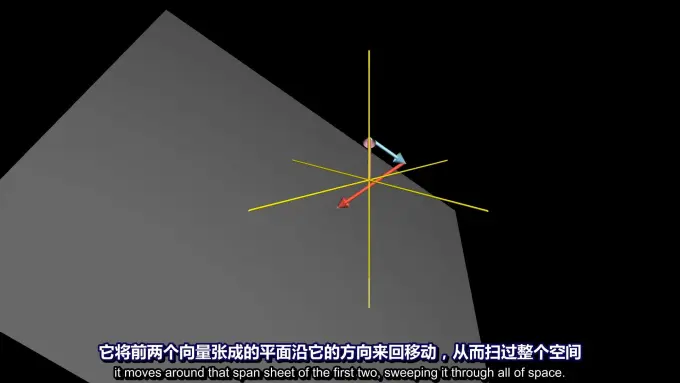

### 2.4、线性相关与线性无关

**线性相关：**当新生成的向量并没有改变给定向量的张成空间时，我们说这个向量与给定向量线性相关。举例：a和b共线，那么a和b线性相关；c和ab组成的张成空间共面，那么c和ab线性相关，即c可以由ab组成。

**线性无关：**向量不在给定向量的张成的空间内，即其会给张成的空间增加新的维度。

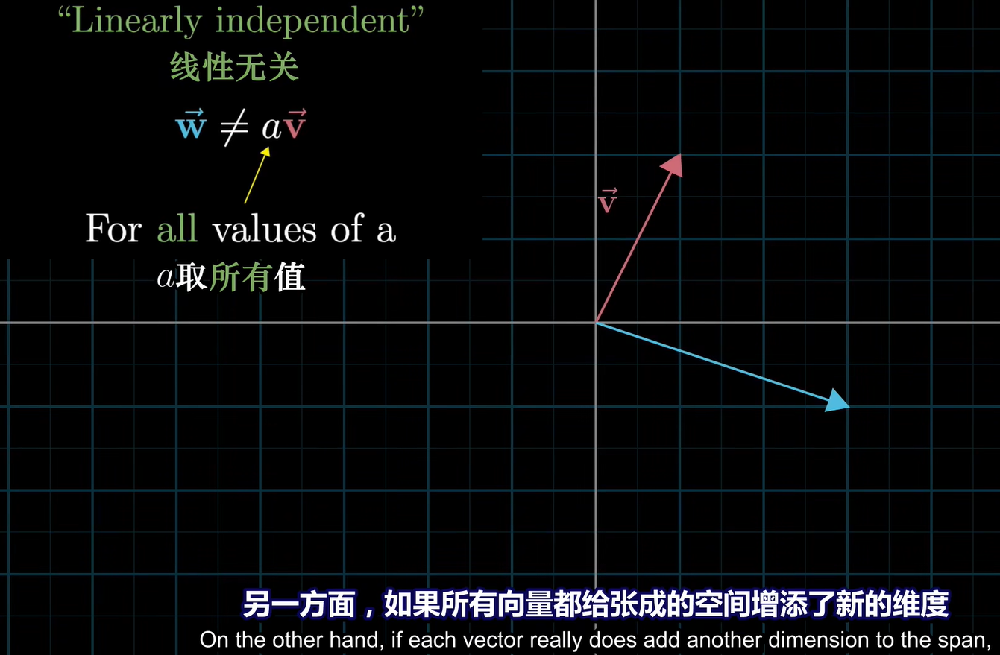

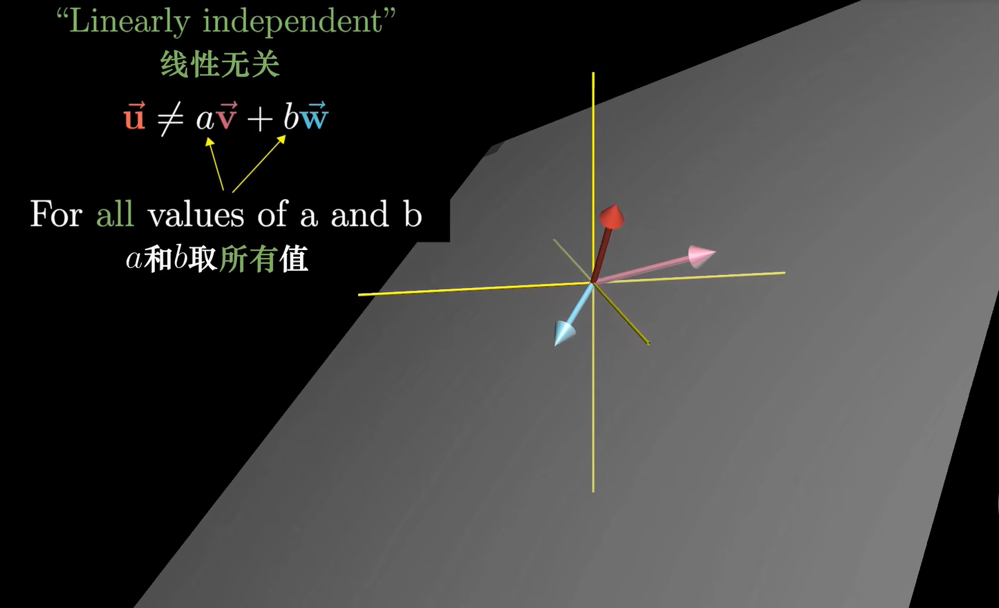

**向量空间的一组基**就是张成该空间的一个**线性无关**向量集。解释：如果向量集中存在**线性有关**，则存在冗余的向量，即存在向量集中共线或者共面的情况。

## 3、矩阵和线性变换

### 3.1、线性变换（linear transformation）

可以理解为一个函数，输入是向量，输出也是向量，但需要保持在变换前后：

* 直线依旧是直线；
* 原点保持固定；

如果用网格表示二维空间的话，需要在变换前后网格线保持**平行且等距**分布。线性变换是对空间的一种变换操作。

### 3.2 、计算变换后的向量值

可以在变换之前确定向量 v 与基向量 i、j 的线性组合关系（**任意向量都能表示为基向量的线性组合**）。之后只需知道变换后的向量 i 和向量 j 的值，就可以得到变换后向量 v 的值。

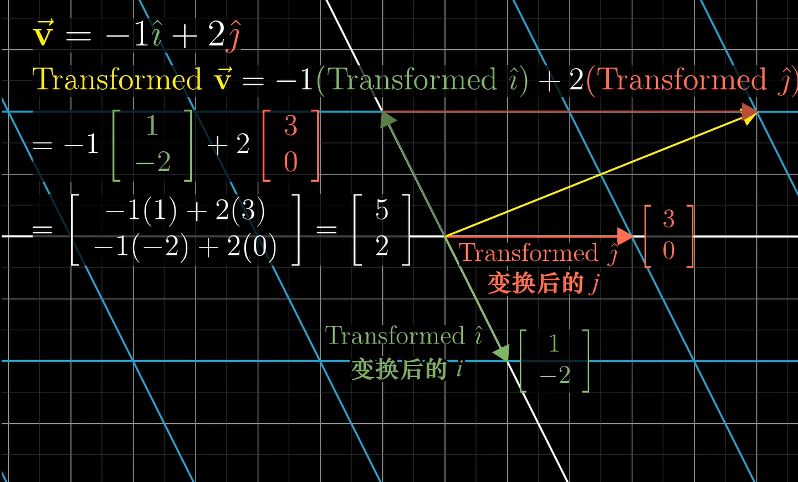

通用的说，对于向量 [x,y] 做变换，可以将第一个矩阵的列（ac、bd）当作变换后空间的基向量，矩阵相乘得到 [x,y] 在新空间的向量。

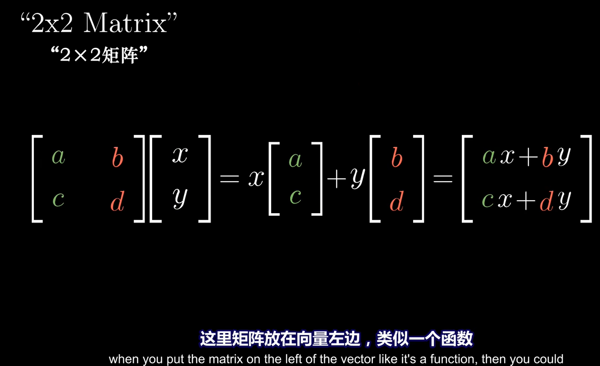

## 4、矩阵乘法与线性变换复合
### 4.1、线性变换复合
举例，进行旋转和剪切的复合变换如下：先左乘旋转矩阵，再左乘剪切矩阵，即按照**从右到左**的顺序进行线性变换。两个矩阵相乘的结果可以得到复合矩阵。

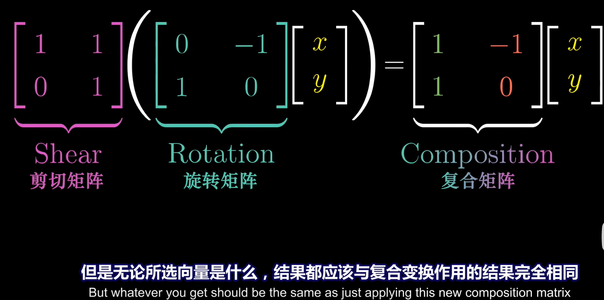

### 4.2、矩阵乘法

矩阵乘法的核心是“行×列”求和，即
$$
C_{i,j} = \sum_{k=1}^{3} A_{i,k} \times B_{k,j}
$$
（i 为行索引，j 为列索引）。

矩阵乘法**具有结合律**（即 (AB)C = A(BC) ），**不具备交换律**（AB ≠ BA）。

可以从线性变换的角度去思考，矩阵乘法如图所示：

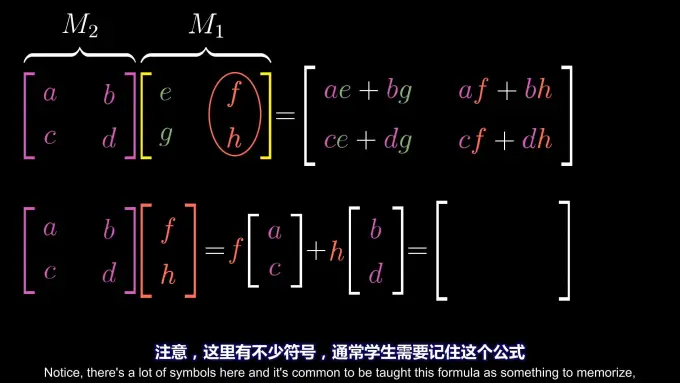

### 4.3、三维空间线性变换复合与矩阵乘法

三维空间线性变换矩阵：以旋转变换矩阵举例，绕y轴旋转。

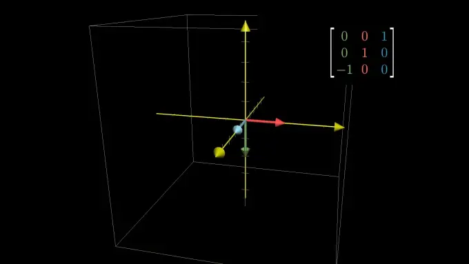

三维线性变换计算方法：

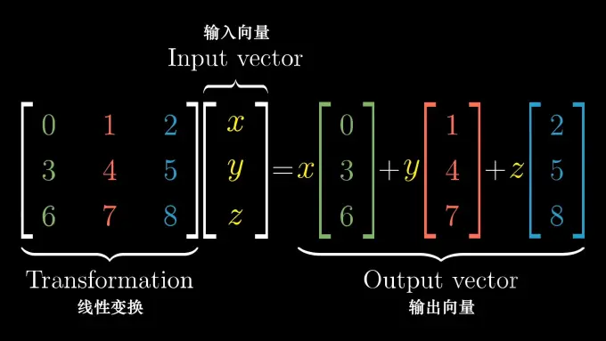

三维复合线性变换：

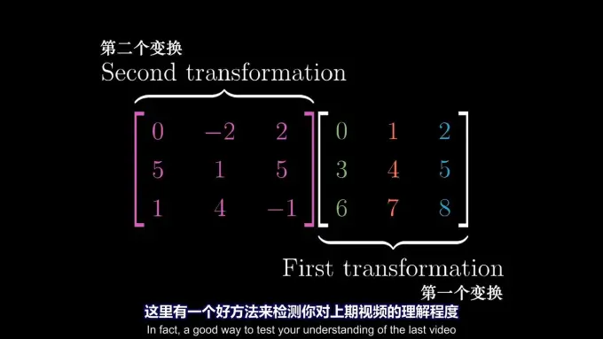

## 5、行列式
行列式的绝对值表示矩阵变换后，单位体积（面积）的缩放比例。

当空间被压缩为一个平面（三维）、一条直线或者一个点时，行列式为0。

当空间定向改变的情况发生时 ，行列式为负。在三维空间中可以通过 ”右手原则“ 来判断定向是否发生了改变。

右手原则：食指指向 i-hat 方向，中指指向 j-hat 方向，大拇指指向 k-hat 方向。

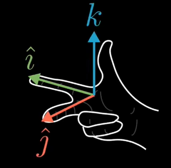

### 5.1、计算公式

2×2矩阵的行列式计算公式如下：

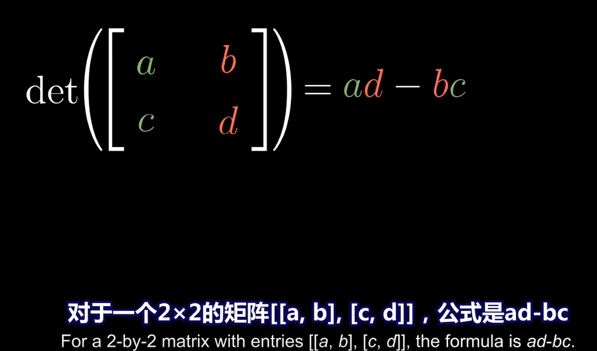

推导过程如下：

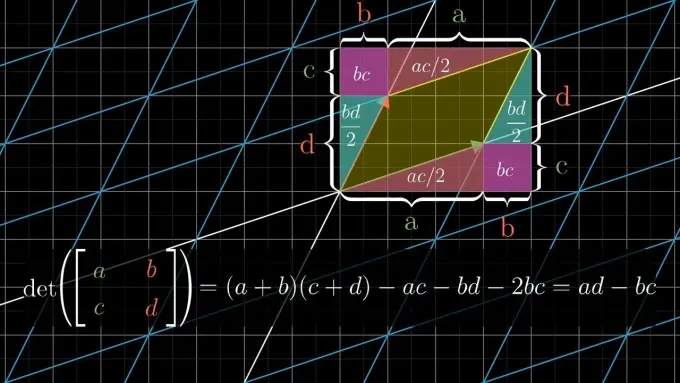

3×3矩阵的行列式计算公式：det(A)=a(ei−fh)−b(di−fg)+c(dh−eg)

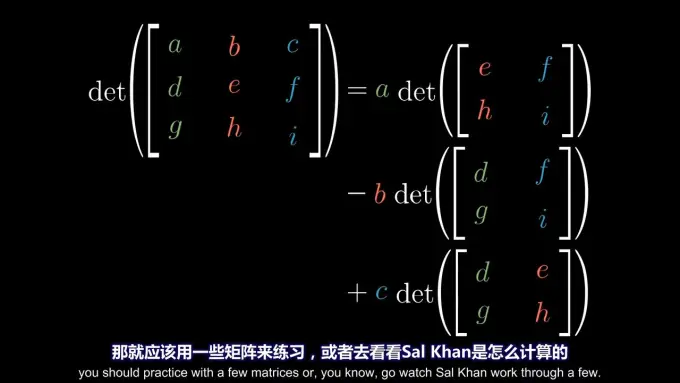

## 6、逆矩阵、列空间、零空间和非方阵

### 6.1、逆矩阵
**定义**：

对于 *n*×*n* 方阵 *A*，如果存在矩阵 $A^{-1}$ 使得：
$$
AA^{-1}=A^{-1}A=I
$$
则称 $A^{-1}$ 为 A 的**逆矩阵**，A 称为**可逆矩阵**。

将一个线性方程组计算赋予几何意义，可以理解为已知一个矩阵 A 和一个向量 v，在寻找向量 x，向量 x 满足通过线性变换 A 后与向量 v 重合。

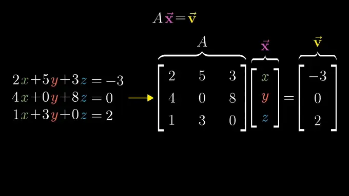

**几何意义**：

逆矩阵 = **原变换的"撤销"操作**

| 性质            | 几何解释                           |
| :-------------- | :--------------------------------- |
| $A^{-1}$ 存在   | 变换是"一一对应"的，可以完美还原   |
| $A^{-1}$ 不存在 | 变换压缩了维度，信息丢失，无法还原 |

**讨论 A 的行列式为 0 时，为什么不存在 A 逆**

只要变换矩阵 A 不将空间压缩到一个更低的维度，也就是A的行列式不为0，那它就存在逆变换，A逆。
因为原来平面上的无数个不同的 x，可能都被映射到了这条直线上的同一个点 v，逆变换的过程中存在**一对多**的关系，不是函数可以解决的。

**讨论 A 的行列式为0时，解是否存在**

这里的解是求出向量 x。若向量 v 位于这条压缩的直线上时，则存在解，否则不存在。

因为 A 的列向量张成的空间是这条直线，则 Ax 必然在这条直线上，若向量 v 不在，则就无法找到一个向量 x 满足。

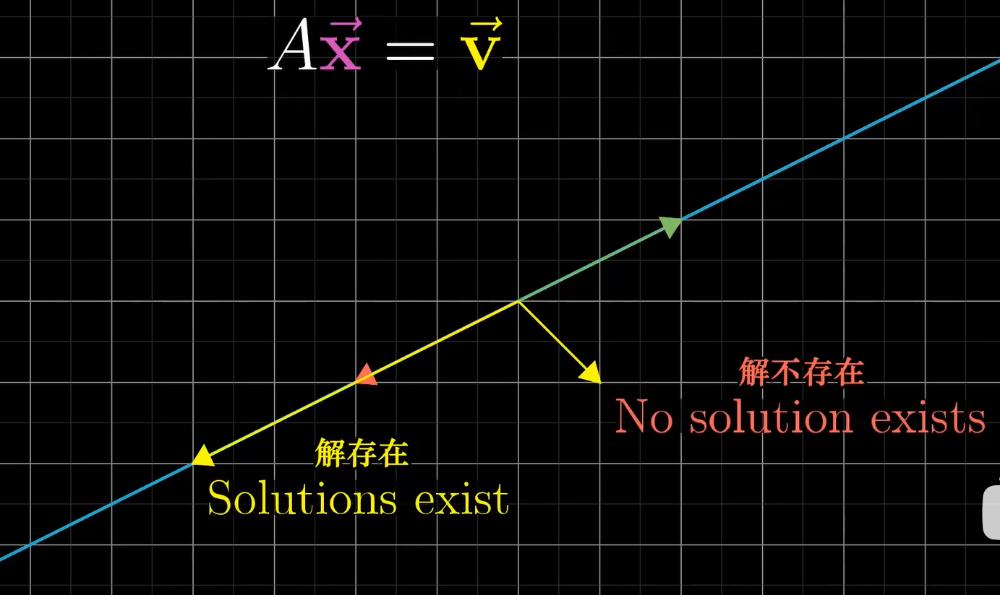

### 6.2、列空间
矩阵的列所张成的空间称为矩阵的列空间。

### 6.3、秩（rank）
**定义**：其线性无关的行（或列）的最大个数。
**几何意义**：矩阵变换后，像空间（输出空间）的维度。

| 秩的情况              | 几何意义                       |
| :-------------------- | :----------------------------- |
| rank(*A*)=*n*（满秩） | 变换保持维度，不压缩空间       |
| rank(*A*)<*n*（降秩） | 空间被压缩到更低维的子空间     |
| rank(*A*)=1           | 所有向量都被映射到同一条直线上 |
| rank(*A*)=0           | 零矩阵，所有向量映射到原点     |

### 6.4、零空间
定义：变换后落在原点的向量的集合，称为矩阵的 “零空间” 或 “核”。

对于一个满秩变换来说，唯一能在变换后落在原点的就是零向量自身。但对于非满秩变换来说，其会将空间维度降低，则会有一系列向量在变换后变为零向量。

### 6.5、非方阵

定义：表示行数和列数不相等的矩阵。

一个 m×n 的非方阵，是把 n 维向量 x，映射成 m 维向量 v。 

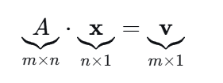

用线性方程组来看的话，可以理解为：

- m = 方程的个数 = 矩阵 A 的行数
- n = 未知数的个数 = 矩阵 A 的列数

#### 6.5.1、矩阵 (m>n)：从低维到高维

方程数多于未知数，通常无解。因为输出向量 v 很可能不在那个“低维平面”上，只有 v 恰好在 A 的列空间时才有解。

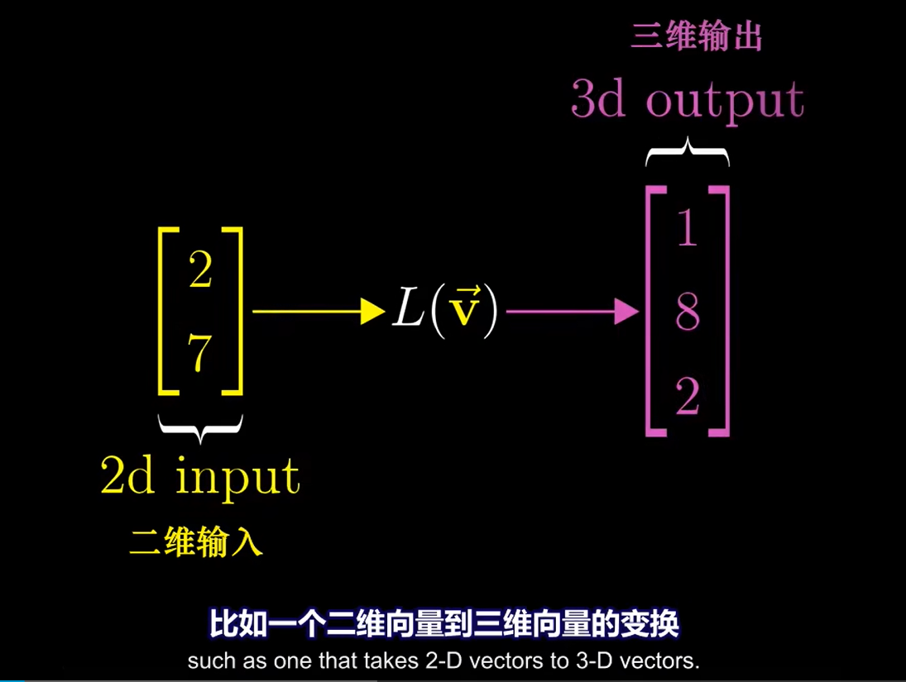

#### 6.5.2、矩阵 (m<n)：从高维到低维

方程数少于未知数，通常有无穷多解。这正对应了“高维压到低维，无数原像重合”的情形。

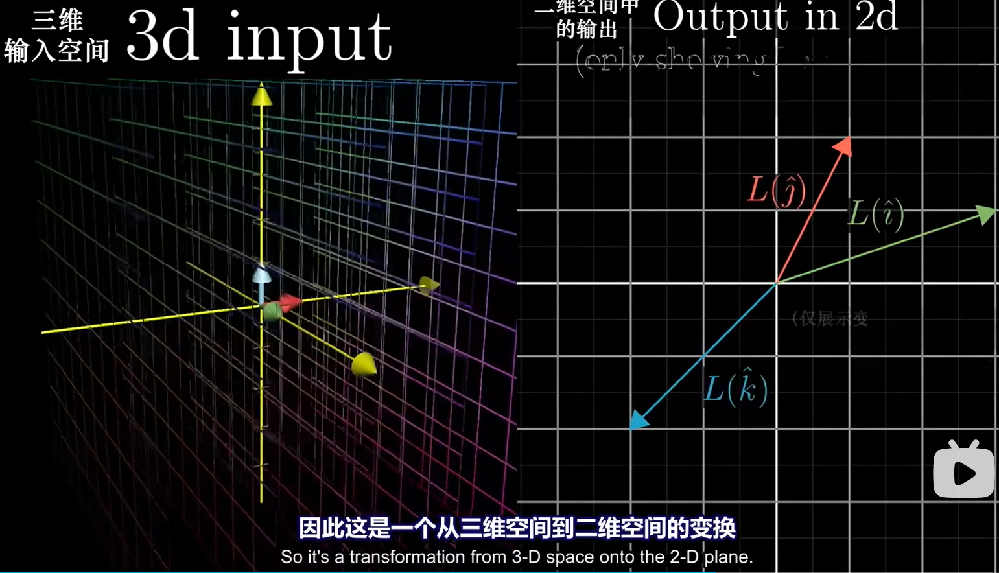

## 7、点积
在代数上的定义：**两个向量对应元素（按照行）相乘在求和**的运算，其结果为**标量（数值）**，反映**向量在方向上的相似度**。

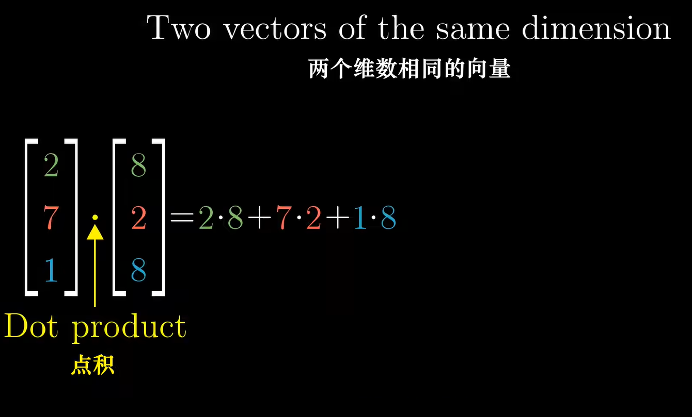

在几何上的定义：点积等于向量 w 的长度乘以夹角余弦（基于向量 v 的**投影长度**），然后与向量 v 的长度的乘积。
$$
\vec{v}·\vec{w} = ||\vec{v}||·||\vec{w}||cosθ
$$
解释相乘的过程，即向量 w 的投影长度（向量 w 的模乘以夹角的余弦值）与向量 v 的长度的乘积，换成向量 v 的投影长度与向量 w 的乘积，结果一致。

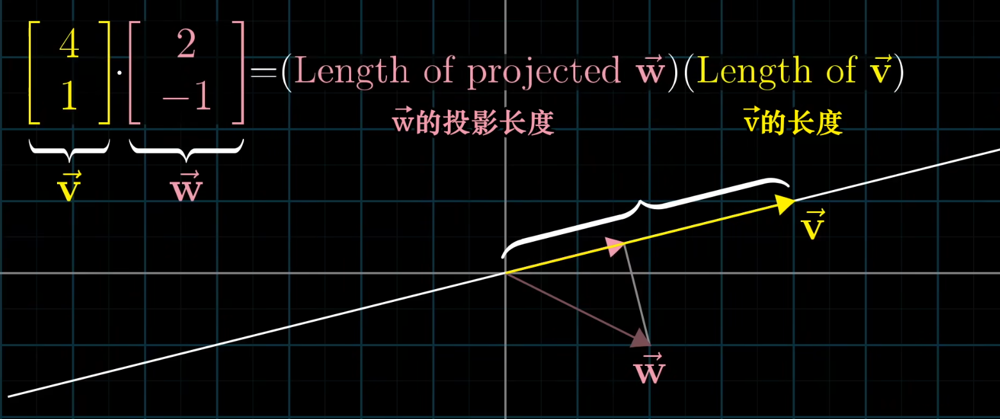

点积判断两个向量方向相似度：

* 两个向量的指向大致相同时，点积值为正：
  $$
  \vec{v}·\vec{w} > 0
  $$

* 两个向量的指向垂直时，一个向量在另一个向量上的投影为零向量，点积值为0：
  $$
  \vec{v}·\vec{w} = 0
  $$
  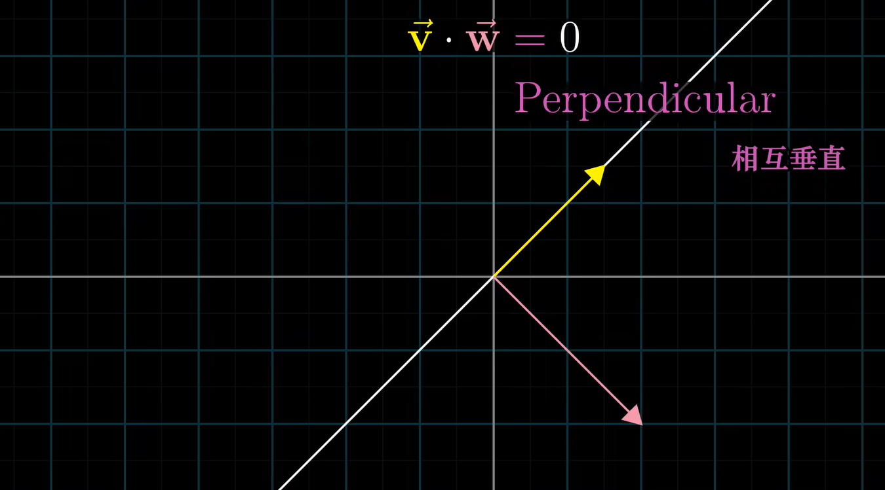

* 两个向量的指向相反时，点积为负值：
  $$
  \vec{v}·\vec{w} < 0
  $$

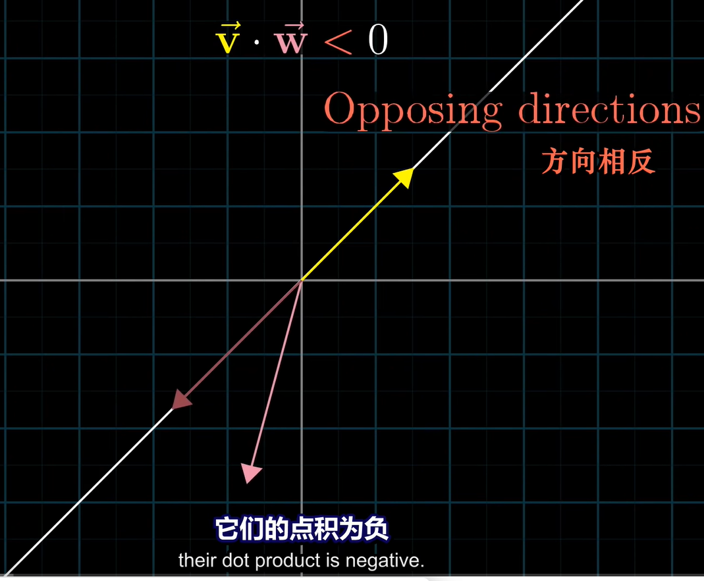

可以通过对称轴的对称性来计算投影长度。
												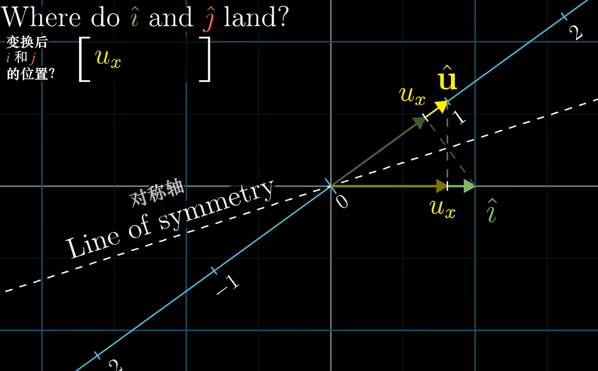 

## 8、叉积

1. 叉积的结果是一个**向量**，长度为两个向量围成的**区域面积**，向量的方向**垂直**于这个平面。

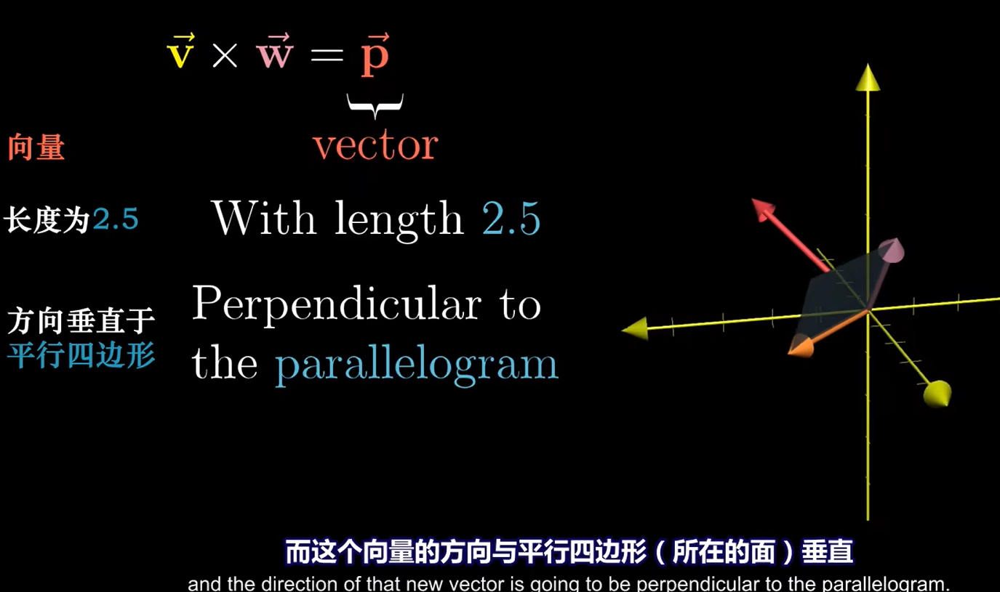

2. 通过右手定则，食指表示向量 v，中指表示向量 w，则叉积结果向量 p 的方向为**大拇指指向**的方向。

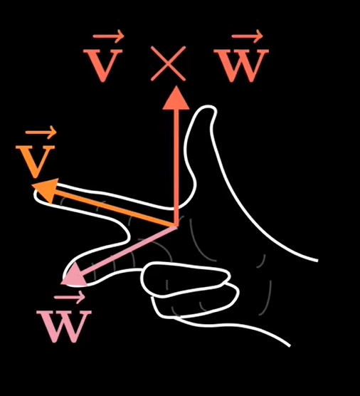

3. 叉积和点积的几何关系：当将向量 p 和某个向量 (x, y, z) 点乘时，所得到的结果等于一个由 (x, y, z) 和向量 v 和向量 w 确定的平行六面体的体积（3×3 矩阵的行列式）。

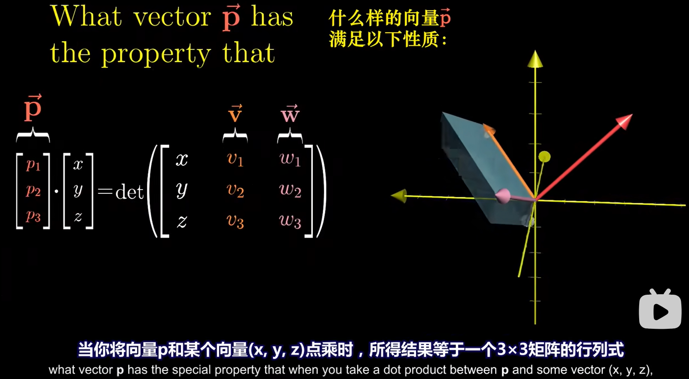

​		左边展开为：
$$
p_{1}x + p_2{y} + p_3{z}
$$
​		右边展开为是向量 v 和向量 w 的叉积在与向量 (x, y, z) 的点积：
$$
(\vec{v}×\vec{w})⋅(x,y,z) = x(v_2w_3−v_3w_2)−y(v_1w_3−v_3w_1)+z(v_1w_2−v_2w_1)
$$
​		则公式可以简化为：
$$
\vec{p} · (x, y, z) = (\vec{v} × \vec{w}) · (x, y, z)
$$
​		从几何意义出发，等号左边表示为向量 (x, y, z)  的投影长度乘以向量 p 的长度（向量 p 垂直于平行六面体的		底面）。而等号右侧是一个平行六面体，底面是由向量 v 和向量 w 组成的，这时计算这两个向量（v、w）的		叉积，可以得到一个向量值，与底面垂直，这个向量值与向量 p 的值相同。

4. 顺序对叉积有影响，即

$$
\vec{v}×\vec{w}=-\vec{w}×\vec{v}
$$

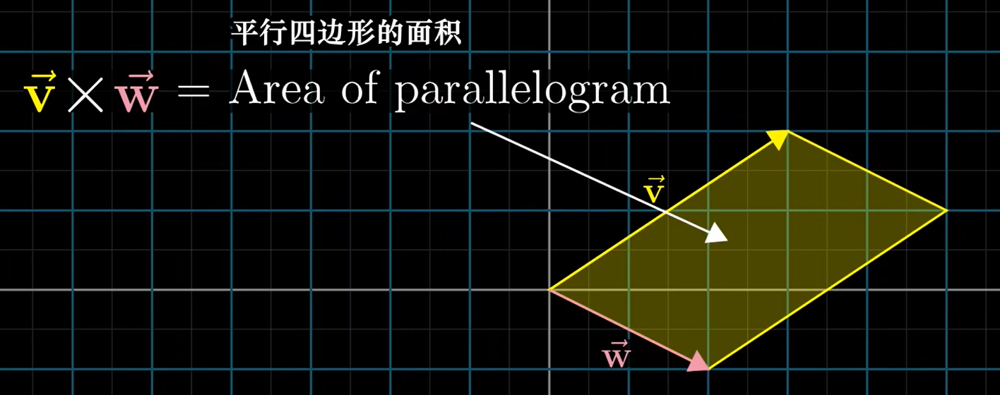

## 9、基变换
定义：描述如何将一个向量从一个基（坐标系）转换到另一个基。

线性变换的基本特性：变换前后仍旧是**相同的线性组合**，不过使用的是**新的基向量**。

### 9.1、过渡矩阵

基变换借助过渡矩阵来实现，过渡矩阵 P 是由**新基向量在旧基下的坐标组成的矩阵**，满足：
$$
[x]_B = P · [x]_C
$$
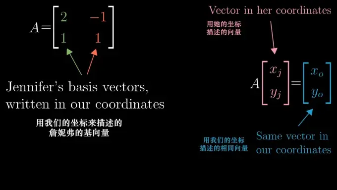

其中 B 为旧基，C 为新基，如果要计算旧基在新基下的坐标，则需要借助 P 矩阵的逆来实现：
$$
[x]_C = P^{-1} · [x]_B
$$
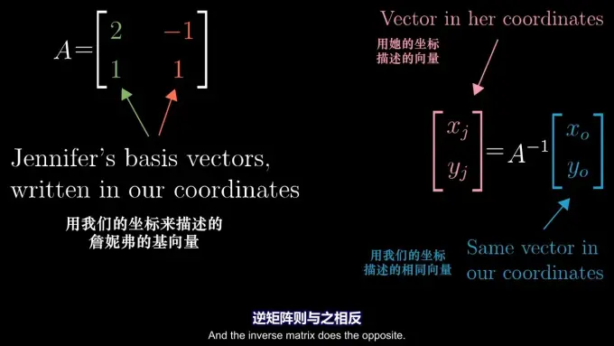

### 9.2、同一线性变换在不同基下的矩阵之间的关系

已知线性变换 T，在旧基 B 下的变换矩阵是 A（即变换后的 B 下坐标 = A · [x]_B）。

将基变换到 C 后，同一个 T 在新基下的矩阵 A' 是什么？

* 新基下的坐标 [x]_C，**用 P 转换为旧坐标**：[x]\_B = P[x]\_C。
* **执行旧基下的变换**：A · [x]\_B = AP[x]\_C。
* **用 P^{-1} 转换为新基下的坐标**：P^{-1}AP[x]\_C

即通过 `P^{-1}AP ` 公式可以得到同一线性变换在新基下的变换矩阵 A'。

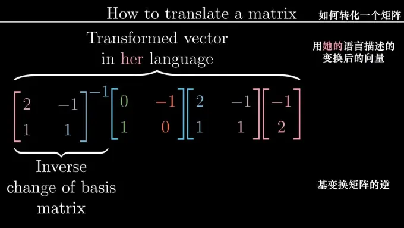

## 10、特征向量和特征值

数值定义：对于矩阵 A，若存在非零向量 v 和标量 λ，使得 Av = λv，则向量 v 是 A 的**特征向量**，λ 是对应的**特征值**。

几何定义：**线性变换后的向量仍在其之前向量所张成的空间内**，这种向量称为 “特征向量”。每个特征向量都有一个所属的值，即衡量特征向量在变换中**拉伸或压缩比例的因子**，称为 “特征值”。

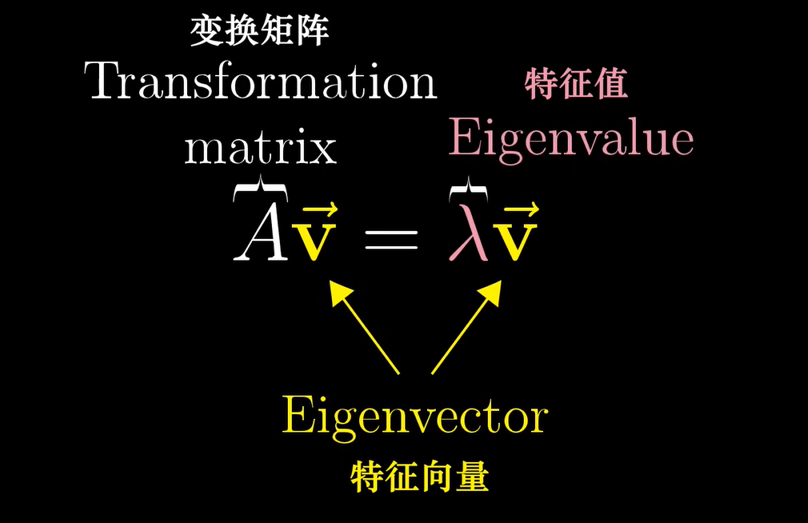

基于上面的等式，进行推导，为了能够让矩阵 A 和 数值 λ 能够进行计算，这里引入单位矩阵 I（对角元均为1）与 λ 相乘，将其变换为矩阵。

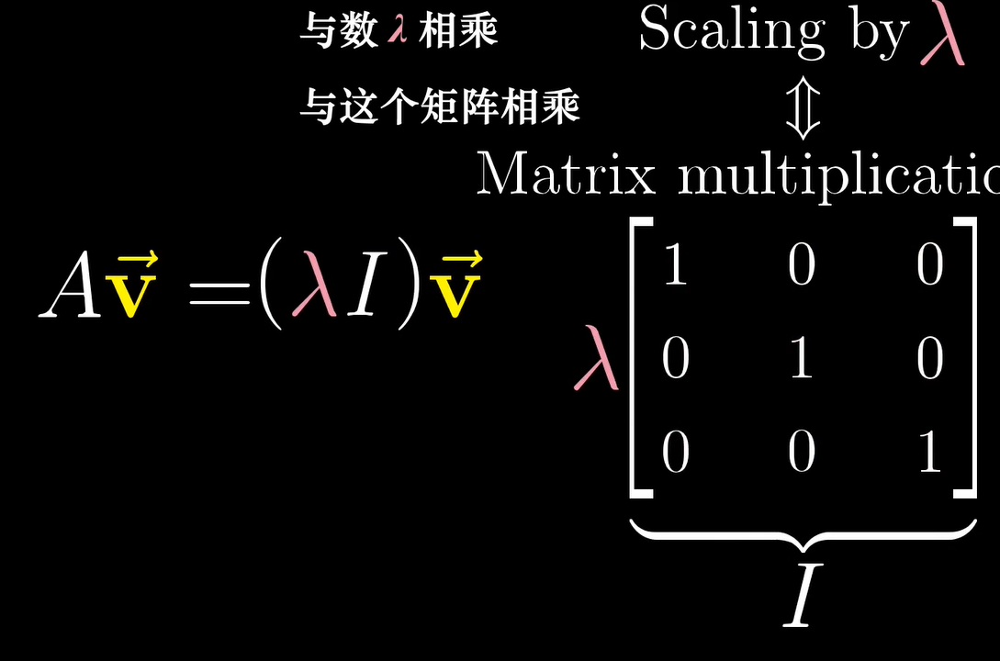

将 λIv 移到等号左侧后，可以将其合并为如下公式：

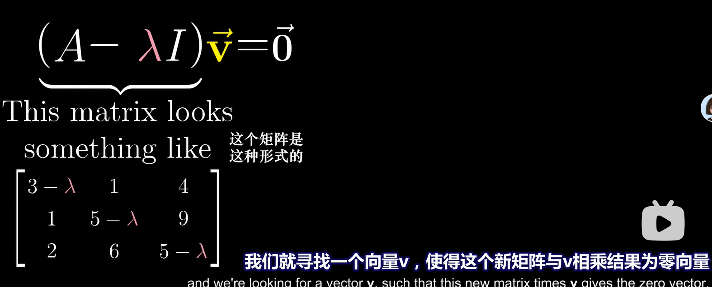

这里将 A - λI 比作矩阵 M，若 det(M) ≠ 0（即 M 可逆），则方程组只有零解（因为左乘逆矩阵得到 v = M^(-1) · 0 = 0，只有向量 v 为 0 时才满足）；若 **det(M) = 0**（即 M 不可逆），则**存在非零解**。

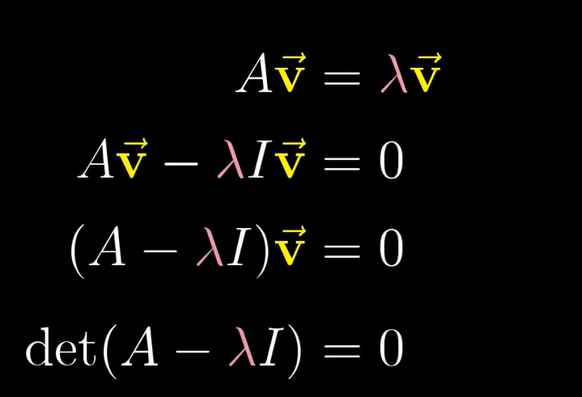

在三维空间内，存在一个特征向量且特征值为1，其实就是物体的旋转轴。

### 10.1、特征空间与特征基

**特征空间**：由**同一特征值**对应的**所有特征向量**的线性组合构成的子空间。

**特征基**：如果一个矩阵 A 的特征向量集合 {v1,v2,…,vn} 线性无关，则它们可以组成一个 A 的特征基。在这个基下，矩阵 A 的线性变换作用仅表现为沿特征向量方向的伸缩，而不改变方向。

换句话说，特征基是特征空间的“扩展”，它将矩阵的所有特征向量组合成一个完整的坐标系，使矩阵在该坐标系下呈对角化形式。

### 10.2、对角化矩阵

**对角化**：矩阵 A 的一组线性无关的**特征向量** { v1, v2, ... , vn }，把它们排列成一个矩阵，记作**特征基矩阵 P**。通过 det(A - λI) = 0 计算得到**特征值** λ，并由 λ 组成**对角矩阵 D**，对角线上的元素为对应的特征值。矩阵 A 可以通过以下表达式**对角化**，这样矩阵的幂运算和指数运算可以大大简化。
$$
A^{k} = (PDP^{-1})^{k} = PD^{k-1}(P^{-1}P)^{k-1}DP^{-1} = PD^{k}P^{-1}
$$

## 11、抽象向量空间

线性的严格定义：

* **可加性**：两个向量的和的应用变换，与其每个向量的应用变换的和相等。
  $$
  L(\vec{v}+\vec{w})=L(\vec{v})+L(\vec{w})
  $$

* **成比例**：将一个向量与某个数值相乘后进行应用变换，与将向量应用变换后在与某个数值相乘相等。
  $$
  L(c\vec{v})=cL(\vec{v})
  $$

基函数：

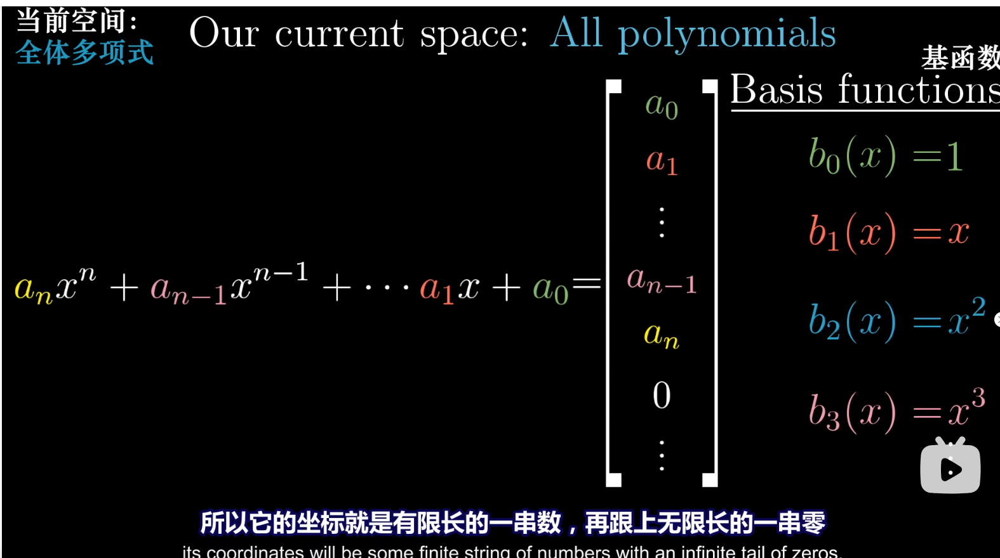

向量加法和数乘的规则：

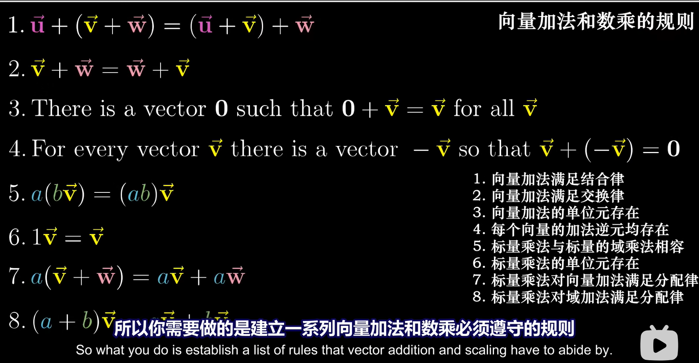

## 12、克莱姆法则

通过变换前后的面积变换定理，固定一条基边就能求出另一条基边变化前的值。

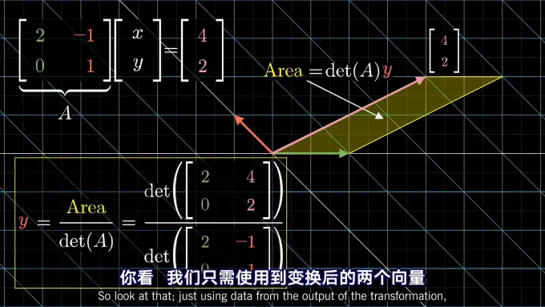
